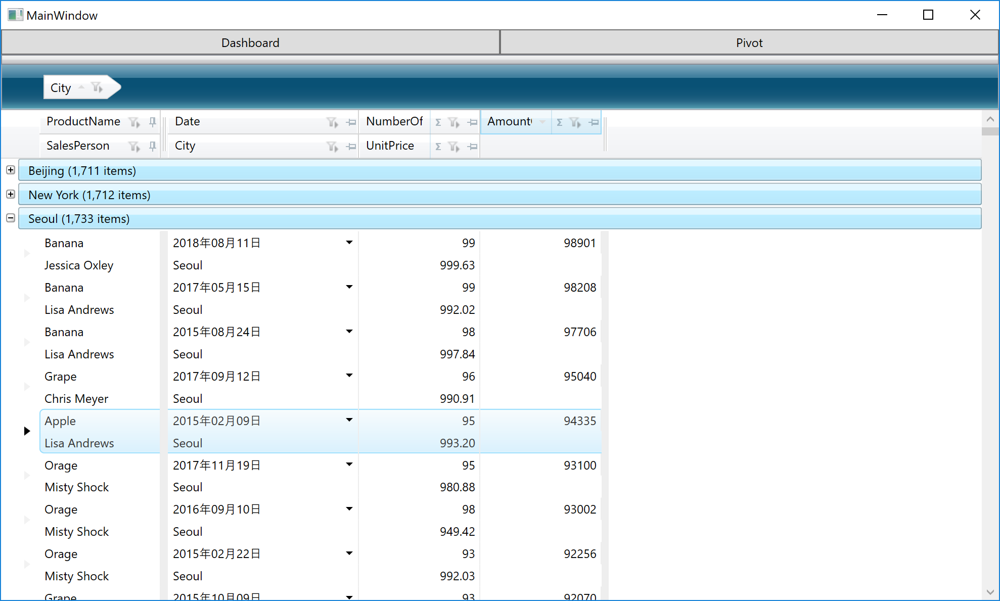

# Configure XamDataGrid
XamDataGrid has a lot of properties that allow you to implement required specifications and make your app more rich very easily.

## Setting some properties of XamDataGrid

Open MainWindow.xaml and set some properties of XamDataGrid to enable filtering, column fixing and summary features.

```xml
...
<Custom:XamDataGrid DataSource="{Binding Path=SalesRecords}" Grid.Row="1" Grid.ColumnSpan="3" Grid.RowSpan="1"  >
    <Custom:XamDataGrid.FieldLayoutSettings>
        <Custom:FieldLayoutSettings FilterUIType="LabelIcons"/>
    </Custom:XamDataGrid.FieldLayoutSettings>
    <Custom:XamDataGrid.FieldSettings>
        <Custom:FieldSettings AllowRecordFiltering="True" FilterLabelIconDropDownType="MultiSelectExcelStyle" 
                                AllowSummaries="True" SummaryDisplayArea="InGroupByRecords" 
                                AllowFixing="NearOrFar"/>
    </Custom:XamDataGrid.FieldSettings>
</Custom:XamDataGrid>
...
```

## Check the result

Run the app and check the result.



## Note
XamDataGrid has a lot more properties you can use. If you want to know more about it please check the help and the API reference.

[XamDataGrid: Help and Reference](https://www.infragistics.com/help/wpf/xamdatagrid)

## Next
[03-Serviceの追加と利用](03-Serviceの追加と利用.md)
