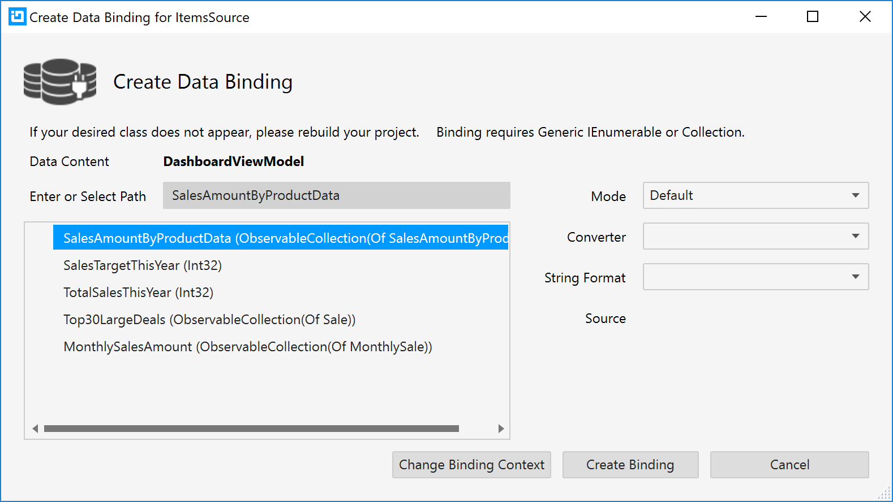

# Configure PieChart

You add a pie chart here to express the ratio of the amount of sales by products. You use XamPieChart to achieve it and configure it by Infragistics Control Configulator.

## Check the datasource to be bound to XamPieChart.

Open DashboardViewModel.cs, set a breakpoint and start debugging to see what's in the bound data SalesAmountByProduct. That should be like below 

| AmountOfSale | ProductName |
----|---- 
| 123 | Banana |
| 456 | Grape |
| ... | ... |

## Put XamPieChart

In Dashboard.xaml, put XamPieChart on the first tile and reset its layout.

Dashboard.xaml

```xml
...
<ig:XamTile
    Header="Sales Amount By Product in this year"
    ig:XamTileManager.Column="0"
    ig:XamTileManager.Row="0" 
    ig:XamTileManager.ColumnSpan="1"
    ig:XamTileManager.RowSpan="1">
    <ig:XamPieChart />
</ig:XamTile>
...
```

## Configure XamPieChart with Control Configulator.

Click the line of the XamPieChart definition and then a light bulb should show up on the left side. Hit Ctrl + . or click the light bulb and select "Configure XamPieChart".


Then the configulator shows up. 


The first thing you need to do on the configulator dialog is to specify the bound data. Find ItemsSource property in the property window and Select "Create Data Binding".



In the data binding dialog, bindable properties in the corresponding ViewModel are listed by default. Select SalesAmountByProductData and click the button "Create Binding".


The configulator detects properties in the bound collection, which is SalesAmountByProductData in this case, and automatically set LabelMemberPath and ValueMemberPath properties.

Configure XamPieChart as you like and then click the button "Apply & Close" when you completed.


## Check the result

Run the app and check the result.


## Note
Of cause you can change properties directly by modifying XAML code instead of using Control Configulator. If you want to learn more about XamPieChart, check the help topic here.
[Getting Started with XamPieChart
Getting Started](https://www.infragistics.com/help/wpf/piechart-getting-started-with-piechart)

## Next
[03-Serviceの追加と利用](03-Serviceの追加と利用.md)
