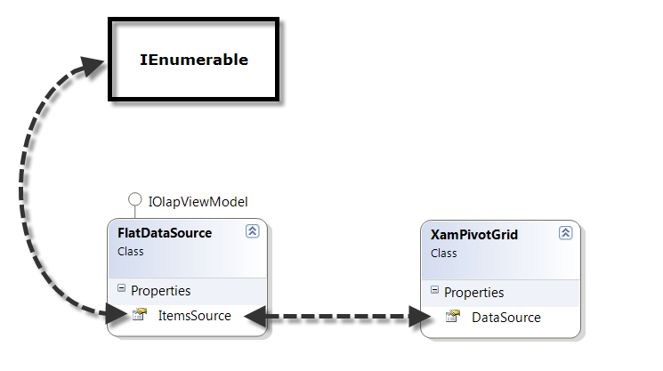

# Use FlatDataSource

If you have an olap server, e.g. SQL Analytics Server and Oracle Essbase, then you can connect them from Infragistics Pivot controls to express the result on the analytics with Pivot UI. If you don't have those you should use FlatDataSource to be bound to Pivot controls, which can process BI requests, like filtering, slicing and drilling down, on your local machine (on your local memory).



## Check PivotViewModel.cs

Open PivotViewModel.cs and check what's in the class.

```cs
...
    class PivotViewModel
    {
        public event PropertyChangedEventHandler PropertyChanged;

        public PivotViewModel()
        {
            //Get all data required in the pivot controls
            SalesDataSample salesDataSample = new SalesDataSample();
            var flatDataSource = new Infragistics.Olap.FlatData.FlatDataSource();
            flatDataSource.ItemsSource = salesDataSample.SalesData;
            salesFlatDataSource = flatDataSource;
        }

        //Flat DataSource to be bound to pivot controls
        private FlatDataSource salesFlatDataSource;
        public FlatDataSource SalesFlatDataSource
        {
            get { return salesFlatDataSource; }
        }
    }
...
```

This class has
 - SalesFlatDataSource to be bound to pivot controls

Original data to be bound to FlatDataSource is "SalesData" which is same as what you bound to the grid in the Section 1.

Note that you didn't write code but just checked what's in the View and the ViewModel in this page.

## Note

If you want to know more about FlatDataSource and other supported data sources check the following help topics.

[Binding xamPivotGrid to FlatDataSource](https://www.infragistics.com/help/wpf/xampivotgrid-databinding-using-flatdatasource)

[Supported DataSource other than FlatDataSource](https://www.infragistics.com/help/wpf/xampivotgrid-binding-data-to-the-xampivotgrid)

## Next
[03-02 Use Pivot Controls](03-02-Use-Pivot-Controls.md)
